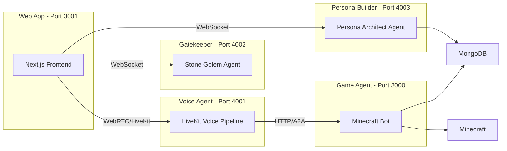
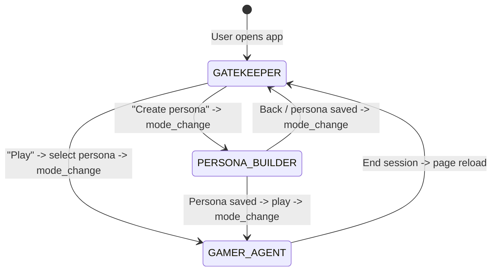

# Dory — AI Gaming Companion for Minecraft

<p align="center">
  
</p>

<p align="center">
  <strong>Let AI companions superpower your players' experience.</strong><br />
  Integrate an AI game companion with voice, memory, and in-game agency — in just a few steps.
</p>

---

### Submission Video

<p align="center">
  <a href="https://youtu.be/T9jMcPh7U_A" target="_blank">
    
  </a>
  <a href="https://www.loom.com/share/cf39ee7d38b3421f87f534ec082c30c1" target="_blank">
    
  </a>
</p>

<p align="center">
  <b>
    ▶️ <a href="https://youtu.be/T9jMcPh7U_A" target="_blank">Submission Video - 1m 20s</a>
    &nbsp; | &nbsp;
    🎬 <a href="https://www.loom.com/share/cf39ee7d38b3421f87f534ec082c30c1" target="_blank">Interactive Walkthrough - 7m 28sec</a>
  </b>
</p>

> The submission video was produced using **Higgsfield** for AI-generated visuals, **CapCut** for editing, and real gameplay interactions captured live from Dory.

---

## What is Dory?

Dory is an open-source AI companion that lives inside your Minecraft world. Players talk to Dory with their voice, and she listens, thinks, remembers, and acts — collecting resources, crafting items, building structures, and holding a natural conversation the whole time.

Under the hood, Dory is a **six-service system** with a web frontend, persona creation tools, voice interaction, and in-game AI agents. The architecture cleanly separates *how the player communicates* (voice) from *what happens in the game* (bot actions), making it straightforward to swap out components, add new games, or integrate into existing projects.

### Key Features

- **🎨 Custom Persona Creation** — Build unique AI companions through an interactive chat interface. Define personality, appearance, gaming style, and voice — all through natural conversation.
- **🌐 Web Application** — Beautiful Next.js frontend with seamless mode transitions between Gatekeeper Chat, Persona Builder, and Gaming Hub. State machine architecture enables smooth handoffs between agents.
- **🎤 Voice Conversation** — Talk naturally using your microphone. Dory listens (Deepgram STT), thinks (LLM), and speaks back (ElevenLabs TTS) in real time via LiveKit.
- **🎮 In-Game Actions** — Follow players, collect resources, craft items, manage inventory, fight mobs, and navigate the world using 30+ tool-calling capabilities.
- **🧠 Multi-Step Planning** — Complex requests like *"gather wood, craft planks, and make me a crafting table"* are automatically broken into a plan and executed step by step.
- **🏗️ AI Structure Generation** — Say *"build me a medieval castle"* and watch it materialize block by block. An LLM generates JavaScript build code, a sandbox executes it, and blocks are placed progressively in the live world.
- **💾 Persistent Memory** — Dory remembers your preferences, past conversations, and goals across sessions using MongoDB-backed episodic, semantic, and procedural memory.
- **⚡ Event-Driven Awareness** — Game events (damage, player joins, task completion) are prioritized and forwarded to the voice agent. Dory reacts to critical events immediately — if she takes fatal damage, she'll tell you about it mid-sentence.

---

## Table of Contents

- [Prerequisites](#prerequisites)
- [Quick Start](#quick-start)
  - [1. Clone and install](#1-clone-and-install)
  - [2. Configure environment](#2-configure-environment)
  - [3. Start MongoDB](#3-start-mongodb)
  - [4. Initialize Database](#4-initialize-database)
  - [5. Start everything](#5-start-everything)
  - [6. Connect and play](#6-connect-and-play)
- [Architecture](#architecture)
  - [Reasoning Engine](#reasoning-engine)
- [Dory AI Web Application](#dory-ai-web-application)
  - [Three-Screen Design](#three-screen-design)
  - [User Flow](#user-flow)
  - [State Machine](#state-machine)
  - [Mode Switching](#mode-switching)
- [Capabilities](#capabilities)
  - [Voice Agent](#voice-agent)
  - [Game Agent](#game-agent)
  - [Memory System](#memory-system)
  - [AI Structure Generation](#ai-structure-generation)
- [Testing Tools](#testing-tools)
- [Project Structure](#project-structure)
- [Available Scripts](#available-scripts)
- [Tech Stack](#tech-stack)
- [API Reference](#api-reference)
- [Troubleshooting](#troubleshooting)
- [For Game Developers](#for-game-developers)
- [License](#license)

---

## Prerequisites

| Requirement | Notes |
|-------------|-------|
| **Node.js 20+** | Runtime for both services |
| **pnpm 8+** | `npm install -g pnpm` |
| **Docker** | For local MongoDB (memory system) |
| **Minecraft Java Edition** | Server running locally or remotely (1.20+) |
| **LiveKit Cloud** | Free account at [livekit.io](https://livekit.io) |
| **API Keys** | Google Gemini (LLM), Deepgram (STT), ElevenLabs (TTS) |

---

## Quick Start

> In case you have trouble setting up the project, you can always watch our [Walkthrough Demo](https://www.loom.com/share/cf39ee7d38b3421f87f534ec082c30c1)

### 1. Clone and install

```bash
git clone https://github.com/your-org/dory.git
cd dory
pnpm install
```

### 2. Configure environment

Each service has its own `.env`. Copy the examples:

```bash
cp services/game-agent/.env.example services/game-agent/.env
cp services/voice-agent/.env.example services/voice-agent/.env
cp services/gatekeeper-agent/.env.example services/gatekeeper-agent/.env
cp services/persona-builder-agent/.env.example services/persona-builder-agent/.env
cp apps/web/.env.example apps/web/.env
```

#### Game Agent (`services/game-agent/.env`)

```bash
GAME_AGENT_PORT=3000

# Minecraft server
MINECRAFT_HOST=localhost
MINECRAFT_PORT=25565
MINECRAFT_AUTH_MODE=offline

# LLM — Gemini 3
LLM_PROVIDER=gemini
GEMINI_API_KEY=...

# MongoDB (memory system)
MONGODB_URI=mongodb://localhost:27017/dory

# AI Structure Builder (optional but recommended)
# Uses a separate, more capable model for generating build code
BUILDER_LLM_PROVIDER=gemini
BUILDER_LLM_MODEL=gemini-3
```

#### Voice Agent (`services/voice-agent/.env`)

```bash
PORT=4001

# LiveKit (required)
LIVEKIT_URL=wss://your-project.livekit.cloud
LIVEKIT_API_KEY=...
LIVEKIT_API_SECRET=...

# Deepgram STT
DEEPGRAM_API_KEY=...

# ElevenLabs TTS
ELEVEN_API_KEY=...

# LLM for voice conversation
LLM_API_KEY=...
LLM_MODEL=gemini-3

# Game Agent URL (A2A connection)
GAME_AGENT_URL=http://localhost:3000
```

> **Note:** We use Google Gemini 3 as the primary LLM across all agents for reasoning, voice conversation, and structure generation.

#### Gatekeeper Agent (`services/gatekeeper-agent/.env`)

```bash
PORT=4002

# Persona Builder Service URL
PERSONA_BUILDER_URL=http://localhost:4003

# Gemini API Key (required for LLM)
GEMINI_API_KEY=...
```

#### Persona Builder Agent (`services/persona-builder-agent/.env`)

```bash
PORT=4003

# MongoDB Connection
MONGODB_URI=mongodb://localhost:27017/dory

# LLM - Gemini 3
GEMINI_API_KEY=...

# Image Generation - Gemini
GEMINI_API_KEY=...

# Cloudflare R2 Storage
R2_ACCOUNT_ID=...
R2_ACCESS_KEY_ID=...
R2_SECRET_ACCESS_KEY=...
R2_BUCKET_NAME=personas
R2_PUBLIC_URL=https://your-r2-bucket.r2.dev

# ElevenLabs (optional, for voice matching)
# ELEVEN_API_KEY=...
```

#### Web App (`apps/web/.env`)

All variables are optional — defaults work for local development:

```bash
# Optional: Override default agent URLs if needed
# NEXT_PUBLIC_GATEKEEPER_WS_URL=ws://localhost:4002/ws
# NEXT_PUBLIC_PERSONA_WS_URL=ws://localhost:4003/ws
# NEXT_PUBLIC_VOICE_AGENT_WS_URL=ws://localhost:4001/ws
# NEXT_PUBLIC_VOICE_AGENT_API_URL=http://localhost:4001
# NEXT_PUBLIC_LIVEKIT_URL=wss://your-project.livekit.cloud
```

### 3. Start MongoDB

Make sure **Docker Desktop** is running:

```bash
docker compose up -d
```

Verify it's running:

```bash
docker ps   # should show "dory-mongo" container
```

> Memory is optional — the bot works without it, but you won't get session summaries or player profiles.

### 4. Initialize Database

Push the Prisma schema for the Persona Builder Agent:

```bash
cd services/persona-builder-agent
npx prisma db push
cd ../..
```

### 5. Start everything

```bash
pnpm dev
```

This builds the shared package, then starts all services (web, gatekeeper, persona-builder, voice, game) with hot-reload via Turborepo.

Or start services individually:

```bash
pnpm dev:web         # Web app only (port 3001)
pnpm dev:gatekeeper  # Gatekeeper agent only (port 4002)
pnpm dev:persona     # Persona builder agent only (port 4003)
pnpm dev:game        # Game agent only (port 3000)
pnpm dev:voice       # Voice agent only (port 4001)
```

### 6. Connect and play

1. **Start your Minecraft server** — Java Edition, offline mode recommended for local testing.

2. **Open the web application** at `http://localhost:3001` in your browser. This is the primary way to use Dory — you'll land on the Gatekeeper Chat interface.

3. **Using the web app:**
   - **Create a persona**: Click "Create New Persona" or say *"I want to create a persona"* → Follow the interactive persona builder flow
   - **Play with a persona**: Click "Let's Play" or say *"I want to play"* → Select a persona → Gaming Hub opens with voice controls
   - **Talk to Dory in Gaming Hub:**
     - *"Join the game"* — connects the bot to Minecraft
     - *"Follow me"* — bot follows your player
     - *"Collect some oak wood"* — gathers resources
     - *"Craft a crafting table"* — crafts items
     - *"Build a pillar where I'm looking"* — places blocks at your crosshair
     - *"Build me a medieval castle"* — AI generates and places the structure block by block

4. **Alternative interfaces:**
   - **Text console** — open `services/game-agent/test-console.html` for a browser-based chat
   - **WebSocket** — connect to `ws://localhost:3000/ws` for a raw command interface
   - **Memory dashboard** — open `services/game-agent/test-memory.html` to inspect stored memories, summaries, and player profile in real time

> **Important for AI structure generation:** The bot must have operator permissions in the Minecraft server. Run `/op <bot_username>` in the server console before asking Dory to generate structures.

---

## Architecture

Dory is a **six-service system** that orchestrates user interaction, persona creation, voice communication, and game control:



| Service | Port | Role |
|---------|------|------|
| **Web App** | 3001 | Next.js frontend — single entry point, state machine for mode transitions, three-screen UI (Gatekeeper Chat, Persona Builder, Gaming Hub) |
| **Gatekeeper Agent** | 4002 | Stone golem personality — routes users to create personas or play games, manages persona selection |
| **Persona Builder Agent** | 4003 | Interactive persona creation — guides users through species → visual details → name → avatar generation → personality → gaming style → voice selection → save |
| **Voice Agent** | 4001 | LiveKit voice pipeline (VAD → STT → LLM → TTS), game-event narration, conversation memory sync, loads persona personality + custom voiceId |
| **Game Agent** | 3000 | Minecraft bot control via mineflayer, LLM reasoning with tool calling, multi-step planning, AI structure generation, persistent memory |
| **Shared** | — | Common types, logger, utilities (`@dory/shared`) |

### Reasoning Engine

When a player makes a complex request, the game agent's reasoning engine decomposes it into a step-by-step plan and executes each step sequentially:

<p align="center">
  
</p>

If a step fails (e.g., missing materials), the engine **re-plans** automatically — adapting the approach based on what actually happened:

<p align="center">
  
</p>

---

## Dory AI Web Application

The web application (`apps/web`) is a Next.js frontend that serves as the single entry point for users. It uses a **state machine pattern** (`StateMachine` + `WebSocketManager`) to manage seamless transitions between three application modes: `GATEKEEPER`, `PERSONA_BUILDER`, and `GAMER_AGENT`.

### Three-Screen Design

- **Gatekeeper Chat** (landing page): Expandable chat UI connected to the Gatekeeper Agent via WebSocket. Users land here and see a hero section with CTAs ("Create New Persona" / "Let's Play"). The Gatekeeper — a stone golem personality — guides users to either create personas or select existing ones to play games.

- **Persona Builder**: 3-column layout (avatar preview, trait cards, chat) connected to the Persona Builder Agent via WebSocket. Real-time persona updates via `persona_update` / `operation_status` messages. Users interactively build personas through a conversational flow: species → visual details → name → avatar generation → personality → gaming style → voice selection → save.

- **Gaming Hub**: 2-column layout (companion sidebar with voice controls, chat transcript) connected to the Voice Agent via LiveKit WebRTC. Supports both voice and text communication. The companion sidebar shows the active persona's avatar, voice controls (mic mute, companion mute), game status, and chat history.

### User Flow

1. **User opens web app** → Lands on Gatekeeper Chat (hero view with CTAs)
2. **"I want to play"** → Gatekeeper fetches popular personas → User picks one → Backend sends `mode_change` to `GAMER_AGENT` → Gaming Hub loads with LiveKit voice connection
3. **"I want to create a persona"** → Backend sends `mode_change` to `PERSONA_BUILDER` → Persona Builder chat interface → User creates persona through conversation → Persona saved → Option to play with new persona or return to Gatekeeper

### State Machine

The frontend `StateMachine` orchestrates mode transitions driven by `mode_change` WebSocket messages from the backend:



Each transition: (1) disconnects current WebSocket, (2) generates/reuses sessionId for the target mode, (3) connects to the new agent's WebSocket passing `conversationSummary` for context continuity, (4) the UI renders the corresponding screen (GatekeeperChat / PersonaBuilder / GamingHub).

### Mode Switching

The backend agents (Gatekeeper, Persona Builder) send `mode_change` WebSocket messages when they detect user intent. The frontend `StateMachine` handles:
- Disconnecting from the current agent's WebSocket
- Connecting to the new agent's WebSocket with the appropriate sessionId
- Passing `conversationSummary` (if available) to preserve context across mode transitions
- Updating the UI to render the correct screen component

This architecture enables seamless handoffs between agents while maintaining conversation context, creating a unified experience despite multiple backend services.

---

## Capabilities

### Voice Agent

| Capability | Description |
|------------|-------------|
| Voice pipeline | Silero VAD → Deepgram Nova 3 STT → Gemini 3 LLM → ElevenLabs TTS |
| Real-time events | Critical game events (death, low health) interrupt Dory mid-sentence |
| Event narration | High/medium events injected into LLM context before each turn |
| Memory sync | Conversation history sent to game agent every 60s for preference extraction |
| Tool calling | LLM uses function calling to control the game agent over HTTP |

### Game Agent

| Category | Tools |
|----------|-------|
| **Movement** | `follow_player`, `come_to_me`, `go_to_position`, `stop` |
| **Collection** | `collect_resource`, `break_block` |
| **Inventory** | `get_inventory`, `has_item`, `equip_item`, `craft_item`, `drop_item`, `eat_food` |
| **Storage** | `store_in_chest`, `get_from_chest`, `list_chest_contents` |
| **Building** | `place_block`, `build_pillar`, `build_wall`, `build_floor` |
| **Player POV** | `place_block_where_player_looking`, `build_pillar_where_player_looking`, `build_wall_where_player_looking` |
| **AI Generation** | `generate_structure`, `cancel_structure` |
| **Vision** | `what_am_i_looking_at`, `what_is_player_looking_at`, `scan_area` |
| **Social** | `get_position`, `get_nearby_players`, `send_chat` |

### Memory System

Dory builds a persistent profile of each player over time — remembering preferences, goals, and shared history across sessions.

<p align="center">
  
</p>

| Type | What it stores |
|------|---------------|
| **Episodic** | Events — deaths, tasks, structures built, combat encounters |
| **Semantic** | Knowledge — player preferences, personality traits, goals |
| **Procedural** | Patterns — success rates, common actions |
| **Summaries** | LLM-generated session summaries and player profiles |

### AI Structure Generation

The builder module generates Minecraft structures from natural language:

1. Player says *"build me a house"*
2. Voice agent forwards the command to the game agent
3. Game agent calculates a build position (in front of the player, snapped to ground)
4. A dedicated LLM generates JavaScript build code using `safeSetBlock` / `safeFill` helpers
5. Code executes in a Node.js `vm` sandbox — no world modifications, just a list of block placements
6. Blocks are placed progressively via `/setblock` commands with configurable delays
7. On completion, a critical event fires and Dory announces *"Your structure is finished!"*

Supports cancellation mid-build (*"stop building"*), hollow/walkable interiors, and validates all blocks against a comprehensive block ID list.

---

## Testing Tools

During development, several browser-based tools are available for testing without the voice pipeline:

<details>
<summary><strong>Game Agent Test Console</strong> — <code>services/game-agent/test-console.html</code></summary>

<br />

A WebSocket-based console for directly interacting with the game agent. Create sessions, send commands, inspect inventory, and test all bot actions via text.

<p align="center">
  
</p>

</details>

<details>
<summary><strong>Memory Dashboard</strong> — <code>services/game-agent/test-memory.html</code></summary>

<br />

Real-time view of stored memories, player profile, session summaries, and system context. Auto-refreshes every 5 seconds.

</details>

<details>
<summary><strong>Voice Test Page</strong> — <code>services/voice-agent/test-voice.html</code></summary>

<br />

Connect to a LiveKit room and talk to Dory directly from the browser. Generates a room token automatically.

</details>

---

## Project Structure

```
dory/
├── package.json                # Root scripts (pnpm dev, build, etc.)
├── turbo.json                  # Turborepo task configuration
├── pnpm-workspace.yaml         # Workspace definition
├── docker-compose.yml          # MongoDB service
│
├── packages/
│   └── shared/                 # @dory/shared — types, logger, utilities
│       └── src/
│           ├── types/          # Session, Minecraft, Agent interfaces
│           └── utils/          # Logger, sleep, retry helpers
│
├── apps/
│   └── web/                    # @dory/web — Next.js frontend
│       └── src/
│           ├── components/     # UI components (buttons, dialogs, inputs)
│           ├── config/         # Agent URL configuration
│           ├── contexts/       # UnifiedAgentContext (state management)
│           ├── hooks/          # useLiveKitSession, useVoiceAgent
│           ├── pages/          # Next.js pages (_app, index)
│           ├── screens/         # Main screens (home with GatekeeperChat, PersonaBuilder, GamingHub)
│           ├── services/       # StateMachine, WebSocketManager, chat persistence
│           ├── theme/          # Styled-components theme (colors, animations)
│           └── types/          # Agent types (AppMode, WSMessage, etc.)
│
└── services/
    ├── gatekeeper-agent/       # @dory/gatekeeper-agent
    │   └── src/
    │       ├── agent/          # Gatekeeper agent logic + prompt
    │       ├── config/         # Environment configuration
    │       ├── services/       # Session management, WebSocket server
    │       └── tools/          # Gatekeeper tools (fetchPopularPersonas, changeMode)
    │
    ├── persona-builder-agent/   # @dory/persona-builder-agent
    │   └── src/
    │       ├── agent/          # Persona builder agent logic
    │       ├── config/         # Environment configuration
    │       ├── db/             # Prisma client
    │       ├── services/       # WebSocket server, persona operations
    │       ├── tools/          # Persona builder tools (savePersona, generateAvatar)
    │       └── types/          # Persona data types
    │
    ├── game-agent/             # @dory/game-agent
    │   └── src/
    │       ├── a2a/            # Agent card + A2A message handler
    │       ├── actions/        # Building, vision, movement, helpers
    │       ├── agent/          # Message handler + system prompt
    │       ├── bot/            # Mineflayer bot wrapper + session manager
    │       ├── builder/        # AI structure generation (LLM → sandbox → placer)
    │       ├── events/         # Event bus, Minecraft listener, A2A forwarder
    │       ├── llm/            # LLM client (Gemini 3)
    │       ├── memory/         # MongoDB memory system (episodic/semantic/procedural)
    │       ├── planning/       # Multi-step plan engine
    │       └── tools/          # Tool registry (30+ tools) + executor
    │
    └── voice-agent/            # @dory/voice-agent
        └── src/
            ├── agent/          # LiveKit conversational agent + persona prompt builder
            ├── clients/        # Persona client (fetches persona data from persona-builder)
            ├── events/         # Event store + fetcher (polls game events)
            ├── routes/          # Room token generation
            ├── services/       # Context service (memory sync)
            ├── tools/          # HTTP tools for game agent control
            └── utils/          # Logger
```

---

## Available Scripts

| Command | Description |
|---------|-------------|
| `pnpm dev` | Start all services with hot-reload |
| `pnpm dev:web` | Start web app only (port 3001) |
| `pnpm dev:gatekeeper` | Start gatekeeper agent only (port 4002) |
| `pnpm dev:persona` | Start persona builder agent only (port 4003) |
| `pnpm dev:game` | Start game agent only (port 3000) |
| `pnpm dev:voice` | Start voice agent only (port 4001) |
| `pnpm build` | Build all packages |
| `pnpm build:shared` | Build shared package only |
| `pnpm typecheck` | Run TypeScript type checks |
| `pnpm clean` | Remove all dist/ and node_modules |

---

## Tech Stack

| Layer | Technology |
|-------|-----------|
| Monorepo | pnpm workspaces + Turborepo |
| Runtime | Node.js 20+ / TypeScript |
| Minecraft bot | mineflayer + pathfinder + collectblock + pvp |
| LLM | Google Gemini 3 (primary for all agents — game reasoning, voice, builder, persona) |
| Voice framework | LiveKit Agents SDK |
| Speech-to-Text | Deepgram Nova 3 |
| Text-to-Speech | ElevenLabs Flash v2.5 |
| Voice Activity | Silero VAD |
| Agent protocol | HTTP REST (A2A with agent cards) |
| Memory | MongoDB 7 (Docker) |
| Code sandbox | Node.js `vm` module |

---

## API Reference

### Gatekeeper Agent — `http://localhost:4002`

| Method | Path | Description |
|--------|------|-------------|
| `GET` | `/health` | Health check |
| `GET` | `/api/sessions/:id/debug` | Get session debug info |
| `WS` | `/ws` | WebSocket connection (mode: GATEKEEPER) |

### Persona Builder Agent — `http://localhost:4003`

| Method | Path | Description |
|--------|------|-------------|
| `GET` | `/health` | Health check |
| `GET` | `/api/personas/public` | List all published personas (public gallery) |
| `GET` | `/api/personas/public/:id` | Get public persona by ID |
| `GET` | `/api/personas` | List user's own personas (hardcoded user-123) |
| `GET` | `/api/personas/:id` | Get persona by ID |
| `DELETE` | `/api/personas/:id` | Delete persona |
| `GET` | `/api/personas/:id/conversational-prompt` | Get conversational prompt for voice agent |
| `GET` | `/api/personas/:id/gaming-prompt` | Get gaming prompt for game agent |
| `WS` | `/ws` | WebSocket connection (mode: PERSONA_BUILDER) |

### Game Agent — `http://localhost:3000`

| Method | Path | Description |
|--------|------|-------------|
| `GET` | `/health` | Health check |
| `GET` | `/.well-known/agent-card.json` | Agent card (A2A discovery) |
| `POST` | `/api/sessions` | Create bot session |
| `GET` | `/api/sessions` | List active sessions |
| `GET` | `/api/sessions/:id` | Get session info |
| `DELETE` | `/api/sessions/:id` | Disconnect bot |
| `POST` | `/api/sessions/:id/message` | Send message (triggers LLM reasoning) |
| `POST` | `/api/a2a/message` | A2A: receive command from voice agent |
| `GET` | `/api/a2a/sessions` | A2A: list sessions with details |
| `GET` | `/api/memory/stats/:userId` | Memory stats (counts by type) |
| `GET` | `/api/memory/profile/:userId` | Player profile |
| `GET` | `/api/memory/system-context/:userId` | Full text context for prompt enrichment |
| `GET` | `/api/memory/memories?userId=X` | List memories (filter by type, tags) |
| `GET` | `/api/memory/summaries?userId=X` | List summaries (filter by type) |
| `POST` | `/api/memory/context` | Receive conversation context from voice agent |
| `POST` | `/api/memory/session-end` | Trigger session-end summary generation |
| `WS` | `/ws` | WebSocket interactive console |

### Voice Agent — `http://localhost:4001`

| Method | Path | Description |
|--------|------|-------------|
| `GET` | `/health` | Health check |
| `POST` | `/api/room-token` | Generate LiveKit room token |
| `POST` | `/api/events` | Receive game events from game agent |
| `GET` | `/api/events` | Poll unannounced events (used by agent worker) |
| `POST` | `/api/events/ack` | Mark events as announced |

---

## Troubleshooting

### `pnpm dev` fails with build errors

```bash
pnpm build:shared   # Rebuild shared package first
pnpm dev             # Then retry
```

### Bot can't connect to Minecraft

- Verify your Minecraft server is running and set to **offline mode** (`online-mode=false` in `server.properties`)
- Default config is `localhost:25565` — adjust in the session creation call if different
- Make sure the bot username isn't already online

### Voice agent connects but doesn't hear me

- Verify `DEEPGRAM_API_KEY` and `ELEVEN_API_KEY` are set in `services/voice-agent/.env`
- Make sure your browser has granted microphone permissions
- Check the browser console for WebRTC errors

### Game commands from voice return "no active bot session"

- Create a bot session first — say *"join the game"* or use the test console
- Verify game agent is running on port 3000
- Check `GAME_AGENT_URL=http://localhost:3000` in voice agent `.env`

### AI structure generation fails

- Make sure the bot has operator permissions: run `/op <bot_username>` in the Minecraft server console
- Ensure `GEMINI_API_KEY` is properly set in the game agent `.env`

### MongoDB / memory not working

- Make sure Docker Desktop is running, then `docker compose up -d`
- Check with `docker ps` — you should see `dory-mongo`
- Verify `MONGODB_URI=mongodb://localhost:27017/dory` in `services/game-agent/.env`
- Memory is **optional** — the bot works without it, you just won't get session summaries or player profiles

### Voice agent crashes with "mutex lock failed"

- Known issue with Silero VAD native runtime during worker shutdown
- Usually harmless — the worker restarts automatically
- If it persists, restart with `pnpm dev:voice`

---

## For Game Developers

Dory's architecture is designed to be modular and extensible:

- **Add new tools** — Define a tool in `tools/registry.ts`, implement it in `tools/executor.ts`. The LLM discovers tools automatically via function calling.
- **Swap LLM providers** — Change `LLM_PROVIDER` in `.env`. Gemini 3 is the default. Add new providers by implementing the `LLMProvider` interface.
- **Change the voice** — Swap `TTS_VOICE_ID` in the voice agent config, or replace ElevenLabs with another TTS provider.
- **Replace the game** — The A2A protocol is game-agnostic. Replace the mineflayer bot with any game's API and the voice agent still works.
- **Add memory types** — Extend the memory system with new document types in `memory/types.ts`.

The A2A protocol between agents is simple HTTP JSON — no proprietary SDKs or complex integrations required.

---

## License

MIT

---

Built with ❤️ by the Dory team.
